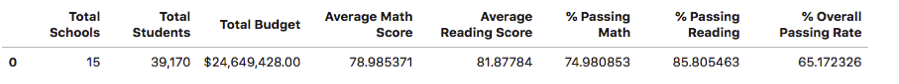

## School Test Performance Trends 

Analyzes District Wide Standardized Test Data Using Pandas

During this project, I analyzed the district-wide standardized test results for a city's school district. Using every student's math and reading scores, as well as various information on the schools they attend, I aggregated the data to showcase obvious trends in school performance.

## Objectives:

### Step 1 - District Summary

* Perform the necessary calculations and then create a high-level snapshot of the district's key metrics in a DataFrame

### Step 2 - School Summary

* Perform the necessary calculations and then create a DataFrame that summarizes key metrics about each school

### Step 3 - Highest-Performing Schools (by % Overall Passing)

* Sort the schools by % Overall Passing in descending order and display the top 5 rows.
* Save the results in a DataFrame called "top_schools"
    

### Step 4 - Lowest-Performing Schools (by % Overall Passing)

* Sort the schools by % Overall Passing in ascending order and display the top 5 rows.
* Save the results in a DataFrame called "bottom_schools"  
    

    
### Step 5 - Math Scores by Grade

* Perform the necessary calculations to create a DataFrame that lists the average math score for students of each grade level (9th, 10th, 11th, 12th) at each school
    

    
### Step 6 - Reading Scores by Grade

* Create a DataFrame that lists the average reading score for students of each grade level (9th, 10th, 11th, 12th) at each school

### Step 7 - Scores by School Spending

* Create a table that breaks down school performance based on average spending ranges (per student)
* Create four bins with reasonable cutoff values to group school spending
* Categorize spending based on the bins and create a new DataFrame

    
### Step 8 - Scores by School Size

* Create a DataFrame that breaks down school performance based on school size (small, medium, or large)

### Step 9 - Scores by School Typeschoo

* Create a DataFrame that breaks down school performance based on school type (charter or district)

---------------------------------------------------

<b>Contact:</b> c.antara12@gmail.com
